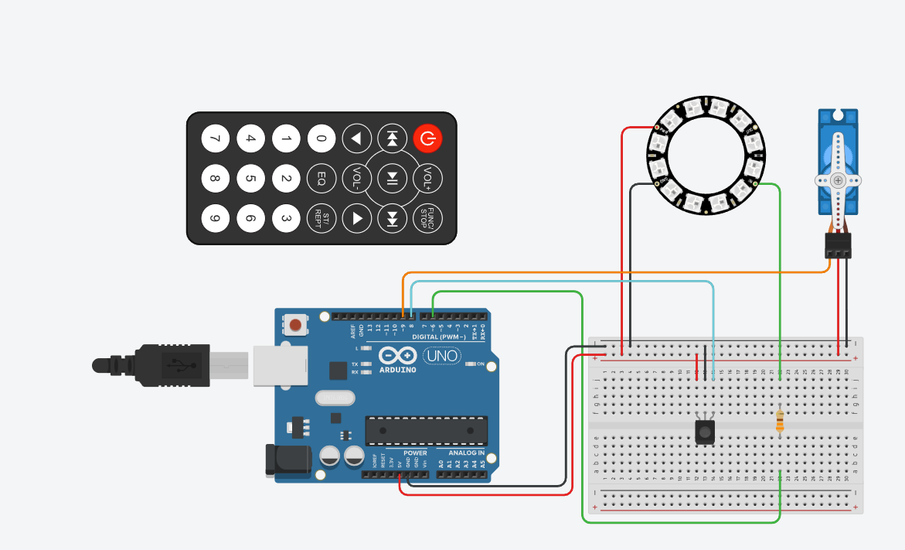
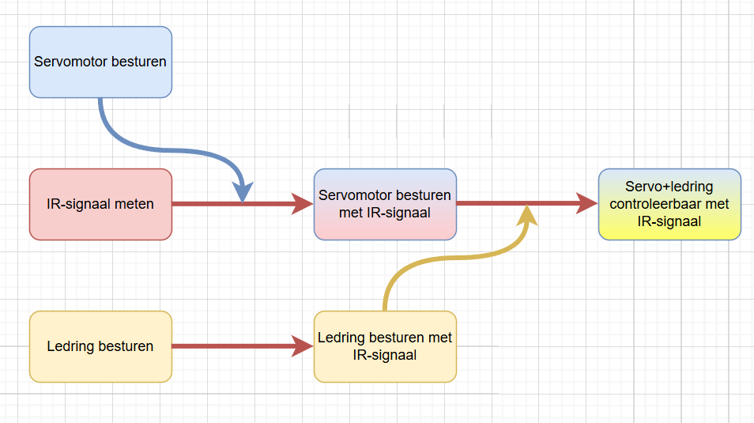

# Emerging_tech_arduino
De overkoepelende opdracht voor het vak Opkomende Technologieën beschrijft het realiseren van een Wizard of Oz prototype voor het project van het vak gebruiksgericht ontwerpen. Het project kan als volgt in een notendop worden beschreven: een wearable die het stressniveau van een zorgverlener communiceert naar een feedbackunit die dit stressniveau van zorgverleners visualiseert met een bewegend dier als metafoor. Het doel hiervan is om meer aandacht te bieden aan stress binnen zorginstellingen, zodat hier beter op ingespeeld kan worden en burn-outs en uitval door stress op lange termijn kunnen worden voorkomen.

Aangezien de hoofdzakelijke focus voornamelijk op de feedbackunit ligt, zal enkel dit aspect worden uitgewerkt als prototype. Als metafoor is gekozen voor een hond die verschillende houdingen kan aannemen: van staand naar zittend en alle tussenliggende posities. De positie van de hond geeft het stressniveau van de zorgverlener weer.
Bijkomend is het de bedoeling dat de feedbackunit enkel de stress status aangeeft als de betreffende gebruiker in de buurt is, dit om negatieve stigmatisering te beperken.
Concreet moet dit prototype voldoen aan volgende vereisten om het te kunnen beschouwen als een geslaagd wizard of zo prototype:

| Vereiste                                                        | Methode/Technologie             |
|------------------------------------------------------------------|----------------------------------|
| Hond die van staan naar zitten beweegt, inclusief tussenposities | Servomotor                       |
| Visuele aanduiding van stressniveau                              | Adafruit Neopixel 12 LED-ring    |
| Draadloze bediening (aan/uit, houdingen, nauwkeurige positiebepaling) | IR-afstandsbediening en -ontvanger |


## Elektronica
Gebruikte componenten:
- [12 led's ledring](https://www.otronic.nl/nl/12-bit-rgb-leds-ws2812b-cirkel-rond-neop-140567797.html?source=googlebase&gad_campaignid=19639985996
)
- [330 ohm weerstand](https://www.bitsandparts.nl/Weerstand-330-Ohm-1-4W-5pct-p101277?gQT=1)
- [Micro servomotor](https://www.bitsandparts.nl/Servo-motor-analoog-Micro-Servo-9g-SG90-180%C2%B0-p1907205?gQT=1)
- [IR-sensor](https://www.amazon.com.be/-/nl/LAOMAO-IR-zender-ontvanger-infrarood-diode/dp/B00EFOTJZE/ref=asc_df_B00EFOTJZE?mcid=ccc62f0bed2f3b54b88e6d84a187dd9d&hvadid=714474122054&hvpos=&hvnetw=g&hvrand=13440445988076704702&hvpone=&hvptwo=&hvqmt=&hvdev=c&hvdvcmdl=&hvlocint=&hvlocphy=9197127&hvtargid=pla-391957536169&psc=1&language=nl_BE)
- [9V batterij](https://www.amazon.com.be/-/nl/Duracell-Plus-Power-Alkaline-batterijen-stuks/dp/B00L6ZBJQC/ref=asc_df_B00L6ZBJQC?mcid=0bd8d411819c35bea0549e8427ceeeae&hvadid=714355656954&hvpos=&hvnetw=g&hvrand=1374928461625661830&hvpone=&hvptwo=&hvqmt=&hvdev=c&hvdvcmdl=&hvlocint=&hvlocphy=9197127&hvtargid=pla-423435131457&psc=1&language=nl_BE)
- [Arduino UNO](https://www.bitsandparts.nl/product/FUNDUINO_ARDUINO_UNO_R3?gad_campaignid=22404178302)
- [DC-to-DC converter](https://be.farnell.com/stmicroelectronics/l7805cv/ic-v-reg-5-0v-7805-to-220-3/dp/9756078)
- [Breadboard](https://sinuss.be/products/psg-bb-170w-breadboard-170-pin-white-pro-signal?currency=EUR)

## Bedradingsschema
Dit schema toont een Arduino Uno die wordt aangestuurd via een IR-afstandsbediening. De IR-ontvanger ontvangt signalen en stuurt die naar de Arduino. Hiermee worden een NeoPixel LED-ring en een servomotor aangestuurd. De LED-ring is verbonden via een 330 ohm weerstand en krijgt, net als de servo, stroom via het breadboard.
 

## Workflow
Om het project gestructureerd aan te pakken, werd het opgedeeld in twee delen: de basiswerking en mogelijke uitbreidingen. Dit zorgt ervoor dat eerst de essentiële functies volledig en stabiel werken, zodat er op een betrouwbare manier verder kan worden gebouwd. Een werkend prototype vereist in elk geval een correct functionerende basis.

**Basiswerking**

De basisfunctionaliteit bestaat uit het laten bewegen van een 3D-print van een hond (via een servomotor) en het weergeven van een LED-signaal (via een ledring). Deze twee elementen reageren op input via een IR-afstandsbediening.
De stappen die hiervoor werden gevolgd:
1.	IR-signalen uitlezen via de seriële monitor.
2.	Verschillende binnenkomende IR-codes herkennen en onderscheiden.
3.	De servomotor aansturen op basis van een geselecteerd IR-commando.
4.	De LED-ring tegelijk met de servo laten reageren op dezelfde input.
   
**Uitbreiding**

In een latere fase kan het systeem uitgebreid worden met een proximityfunctie via Bluetooth. Hierbij werkt de feedbackunit (servo + LED) pas als de gebruiker, die een wearable draagt, zich binnen een bepaalde afstand bevindt.
De uitbreidingsstappen:
1.	Een toestel ontwikkelen dat een Bluetoothsignaal uitzendt (simulatie van de wearable).
2.	De nabijheid van dit toestel meten aan de hand van de signaalsterkte (RSSI).
   
**Aanpak**

Als eerste werd een verbinding gelegd tussen de Arduino en de IR-ontvanger. Met behulp van de seriële monitor konden de unieke codes van elke knop op de afstandsbediening gelogd worden. Vervolgens werd de servomotor aangestuurd op basis van een gekozen IR-waarde. Toen dit betrouwbaar werkte, werd de LED-ring apart getest en later toegevoegd aan de code. Pas toen alle onderdelen afzonderlijk goed functioneerden, werden ze geïntegreerd in één programma. Hieronder is een flowchart gevisualiseerd van de aanpak voor de basiswerking en ook een video van het eerste resultaat.

<div align="center">
  <table>
    <tr>
      <td></td>
      <td></td>
    </tr>
  </table>
</div>


## Problemen onderweg
Zoals bij elk ontwikkelingsproces verliep ook dit project niet zonder uitdagingen. In dit onderdeel worden de belangrijkste problemen besproken die zich tijdens het ontwikkelen van het prototype hebben voorgedaan, samen met de oplossingen die werden toegepast. Elk probleem droeg bij aan een beter begrip van de beperkingen van zowel hardware als software.

### Beperkte functionaliteit in vroege versie
In de eerste versies kon de hond enkel naar een andere positie bewegen (bijvoorbeeld van zittend naar staand) door herhaaldelijk op de plus- of minknop van de afstandsbediening te drukken. Dit was niet alleen onhandig, maar ook weinig representatief voor een realistische interactie. Daarom werd de code uitgebreid zodat specifieke knoppen een voorgeprogrammeerde doelpositie activeren, zoals “zit”, “neutraal” of “sta”. Daarnaast werd er ook een aan-uitknop gedefinieerd. Hierdoor werd de besturing intuïtiever en gebruiksvriendelijker.

### Bounce op bedieningsknoppen
Tijdens de eerste testen bleek dat één druk op een knop van de afstandsbediening vaak als meerdere drukken werd geïnterpreteerd. Dit zorgde ervoor dat bijvoorbeeld het systeem ongewild meerdere keren aan en uit werd geschakeld of de servo te ver bewoog.
Het probleem kwam voort uit het ontbreken van debounce-logica: IR-signalen worden zeer snel na elkaar herhaald verzonden, waardoor één druk meerdere commando’s genereert.
De oplossing was om een softwarematige debounce te implementeren, waarbij voor elke knop (met name de aan/uit-knop) een minimale wachttijd (bijvoorbeeld 500 ms) tussen opeenvolgende acties werd ingevoerd. Dit zorgt voor betrouwbaardere en stabielere bediening van het systeem.

### Servo beweegt ongewild
Aanvankelijk maakte de servo regelmatig kleine, ongewenste bewegingen, zelfs zonder geldige IR-commando’s. Dit leidde tot veel frustratie, aangezien het leek alsof de motor uit zichzelf begon te bewegen. Na uitgebreide debugging bleek dit te komen doordat de IR-ontvanger voortdurend irrelevante signalen registreerde (zoals code 0 en 64), die elke keer opnieuw verwerkt werden. Hierdoor werd telkens een minisignaal naar de servo gestuurd, wat kleine verschuivingen veroorzaakte.
De oplossing bestond erin om de servo alleen nog aan te sturen wanneer er een geldig commando wordt ontvangen (enkel codes 7, 12, 21, 24 of 94). In alle andere gevallen blijft de servo inactief. 

### Interferentie in bekabeling
Op een bepaald moment bleef de servo bewegen op een onverwachte manier, ondanks dat alle software correct leek. Het bleek dat de voedingskabel en de signaalkabel van de servo te dicht bij elkaar lagen, wat elektrische interferentie veroorzaakte.
Door de voedingskabels van de servo te koppelen met een 2de arduino, werd het probleem opgelost. De opstelling na het oplossen van dit probleem zag er als volgt uit:

<p align="center">
  
  
</p>


Uiteraard was deze opstelling niet optimaal, zeker aangezien de beschikbare inbouwruimte beperkt was. Om deze reden is er na veel zoeken een relatief eenvoudige oplossing bedacht die het mogelijk maakt om de schakeling te doen werken met slechtst 1 arduino die voorzien wordt van voeding door een 9V batterij. De oplossing was om de servo automatisch los te koppelen (detach) wanneer deze niet actief beweegt, waardoor de schokkende minibewegingen geen effect meer hadden op de servo.

### Servo beweegt bij opstart
Bij het inschakelen van de Arduino bleek de servo zich spontaan naar een standaardpositie te verplaatsen. Dit was ongewenst omdat dit kan zorgen voor schade, zeker wanneer de hond fysiek al in een andere positie stond.
De oplossing hiervoor was om bij het opstarten van de Arduino de huidige servo-positie uit te lezen en als beginpositie te registreren. Hierdoor worden onnodige bewegingen bij het opstarten vermeden.

### Delay blokkeert IR-signalen
In het oorspronkelijke programma werd een delay(18) gebruikt om de LED-ring te laten pulseren. Dit zorgde er echter voor dat inkomende IR-signalen niet altijd tijdig geregistreerd werden.
De oplossing was om delay() te vervangen door een millis()-gebaseerde aanpak, waarmee gecontroleerd wordt of er voldoende tijd is verstreken sinds de vorige LED-update. Hierdoor blijft het systeem responsief voor afstandsbedieningscommando’s.

### Onbetrouwbare interrupt-afhandeling
Er werd geëxperimenteerd met interrupts om de IR-signalen te detecteren. In theorie zou dit sneller en efficiënter werken. In praktijk bleek echter dat ongewenste of ‘ruis’-signalen vaak foute triggers veroorzaakten, waardoor valse commando’s werden geregistreerd.
Uiteindelijk werd gekozen om interrupts volledig te vermijden en over te schakelen op polling via de IrRemote-bibliotheek. Deze bleek veel stabieler en nauwkeuriger in het correct verwerken van inkomende IR-commando’s.

### Beperkingen van Tinkercad
Tinkercad bleek niet compatibel met de Adafruit NeoPixel-bibliotheek, wat betekent dat de LED-functionaliteit niet virtueel getest kon worden. Daardoor moest de volledige schakeling meteen in de echte wereld opgebouwd en getest worden.

## Code
De werkende Arduino scripts zijn te vinden via: [code/arduino](Codes/CombinatieServoLedRingV3)


### **Opstart**
In het eerste deel van de code worden libraries en variabelen gedeclareerd om de Arduino te bedienen met een servo-motor, een NeoPixel LED-ring en een IR-afstandsbediening. Daarnaast staat er uitleg over de aansluiting van het prototype en welke libraries geïnstalleerd moeten worden.


```yaml annotate
//Bram Finn Pieter

/*
Aansluitingen:
ledStrip: GND (Grijze kabel) -> GND arduino, 5V (Witte kabel) -> 5V arduino, D (Paarse kabel) -> pin 6
Servo: GND (zwarte kabel) -> GND arduino, 5V (rode kabel) -> 5V arduino, Signaal (Oranje kabel) -> pin 9
IRsensor: GND met GND, 5V met 5V, Output (linker pootje)-> pin 8

Installeer de libraries:
"Adafruit_NeoPixel.h", 
"IRremote" by shirriff, z3to, ArminJo
"Servo" by Micheal Margolis, Arduino

Met behulp van een IR-bakje kan je het besturen.
De servo kan aangestuurd worden met het bakje.
De kleur van de ledring hangt af va nde hoek van de servo.
*/
#include <IRremote.hpp>
#include <Servo.h>
#include <Adafruit_NeoPixel.h>

#define IR_RECEIVE_PIN 8
#define SERVO_PIN 9
#define LED_PIN 6
#define LED_COUNT 12

Adafruit_NeoPixel strip(LED_COUNT, LED_PIN, NEO_GRB + NEO_KHZ800);
Servo servo;

int pos = 0;
int targetPos = 0;
bool systeemActief = true;
bool positieVeranderd = false;
bool servoIsAttached = false;

int RoodGB= 0;
int RGroenB= 0;
int RGblauw=0;
int stapRichting=1;

uint32_t Kleur_Ledring = strip.Color(0, 0, 0);    
unsigned long vorigeTijd = 0;
unsigned long tijd=0;
unsigned long tijdsVerschil=0;


// Debounce
unsigned long laatsteToggleTijd = 0;
const unsigned long debounceInterval = 500;
```

### **Void setup**
In de void setup van de code initialisesert de seriële communicatie, de IR-ontvanger, de LED-strip en de servo, en stelt de beginpositie van de servo in. Het geeft deze startpositie dan ook weer op de seriële monitor.
```yaml annotate
void setup() {
  Serial.begin(9600);
  IrReceiver.begin(IR_RECEIVE_PIN);
  strip.begin();
  strip.show();  // zet alle leds uit

  delay(500);             // tijd om servo manueel te plaatsen
  pos = targetPos = servo.read(); // positie bewaren bij opstart
  Serial.print("Startpositie: ");
  Serial.println(pos);
}
```
### **Besturing ledring**
In deze aparte void-functie wordt de LED-ring aangestuurd. Dit is zo opgezet zodat de functie eenvoudig te hergebruiken en te integreren is in andere codes.
```yaml annotate
void besturingLedring(int aantalLeds, uint32_t kleur) {
  for (int i = 0; i < LED_COUNT; i++) {
      strip.setPixelColor(i, kleur);
    } 
  strip.show();
  }
```

### **Void loop**
Alle code die hieronder staat, bevindt zich binnen de void loop.

#### **IR-signaal**
De code ontvangt IR-commando's om het systeem aan of uit te zetten, de servo te bewegen en de LED-strip te bedienen. Daarbij voorkomt een debounce dat commando's te snel achter elkaar worden verwerkt. Tegelijkertijd wordt de doelhoek voor de servo ingesteld.
```yaml annotate
  if (IrReceiver.decode()) {
    int cmd = IrReceiver.decodedIRData.command;
    Serial.print("Ontvangen IR commando: ");
    Serial.println(cmd);

    if (cmd == 22 && (millis() - laatsteToggleTijd > debounceInterval)) {
      systeemActief = !systeemActief;
      laatsteToggleTijd = millis();

      Serial.print("Systeem actief: ");
      Serial.println(systeemActief ? "JA" : "NEE");

      if (!systeemActief) {
        if (servoIsAttached) {
          servo.detach();
          servoIsAttached = false;
          Serial.println("Servo losgekoppeld (systeem uit)");
        }
        strip.clear();
        strip.show();
      }
    }

    IrReceiver.resume();
  }

    if (systeemActief) {
      if (cmd == 7)    { targetPos = constrain(pos + 10, 110, 190); positieVeranderd = true; }
      if (cmd == 21)   { targetPos = constrain(pos - 10, 110, 190); positieVeranderd = true; }
      if (cmd == 12)   { targetPos = 110; positieVeranderd = true; }
      if (cmd == 24)   { targetPos = 150; positieVeranderd = true; }
      if (cmd == 94)   { targetPos = 190; positieVeranderd = true; }

      // Servo pas opnieuw koppelen bij nieuwe beweging
      if (positieVeranderd && !servoIsAttached) {
        servo.attach(SERVO_PIN);
        servoIsAttached = true;
        Serial.println("Servo opnieuw gekoppeld");
      }
    }

    IrReceiver.resume();
```


#### **Servo**
Hieronder staat de code die de servo langzaam beweegt naar de doelpositie wanneer het systeem actief is en de positie is veranderd.
```yaml annotate
  if (systeemActief && positieVeranderd && servoIsAttached) {
    if (pos != targetPos) {
      pos += (pos < targetPos) ? 1 : -1;
      servo.write(pos);
      delay(20);
    } else {
      positieVeranderd = false;

      // Servo uitschakelen als beweging klaar is
      servo.detach();
      servoIsAttached = false;
      Serial.println("Servo beweging voltooid → detach()");
    }
  }
```

### **Ledring**
Dit deel zorgt ervoor dat de LED-ring pulserend werkt zolang het systeem actief is. De kleur verandert afhankelijk van de hoek die de servo moet aannemen.
```yaml annotate
  // LED pulsering
  if (systeemActief) {
      tijd=millis();// werken met Millis voor delay te vervangen -> focus op 16 keer pulseren per minuut (ademhalingsritme) -
      tijdsVerschil= round(tijd-vorigeTijd);
      if (tijdsVerschil >= 18.75) {
        vorigeTijd = tijd;
      }

      
      // Rustig groen pulserend 
      // Groen 50 naar 255
      if (targetPos == 190 && tijdsVerschil>18.75) {
        if (RoodGB>=254) {stapRichting = -1;}
        else if (RoodGB<=80) {stapRichting = 1;}
        RoodGB = RoodGB + stapRichting * 1.75;
        RGroenB = 10+ (RoodGB-80)/3.5;// RGroenB is afhankelijk van RoodGB
        RoodGB = constrain(RoodGB, 80, 255);
        RGroenB = constrain(RGroenB, 10, 60);

        Kleur_Ledring = strip.Color(RoodGB, RGroenB, 0);
        besturingLedring(12, Kleur_Ledring);
      }
            // Rustig groen pulserend 
      // Groen 50 naar 200
      else if (tijdsVerschil>18.75){// 18.75 -> 16 keer pulseren per minuut (ademhalingstempo)
        if (RGroenB>=200) {stapRichting =-1;} // eenmaal het maximaal heeft bereikt 
        else if (RGroenB<=50) {stapRichting =1;}
        RGroenB = RGroenB + stapRichting * (200-50)/100; // 2.05= (200-50)/100
        RGroenB = constrain(RGroenB, 50, 200); // extra veiligheid

        Kleur_Ledring = strip.Color(0, RGroenB, 0); // RGB-code toekennen aan een variable
        besturingLedring(12, Kleur_Ledring); // variable doorsturen naar zelfgemaakte functie die ledRing aanstuurt (zie onder void loop)
      }
    }
```

